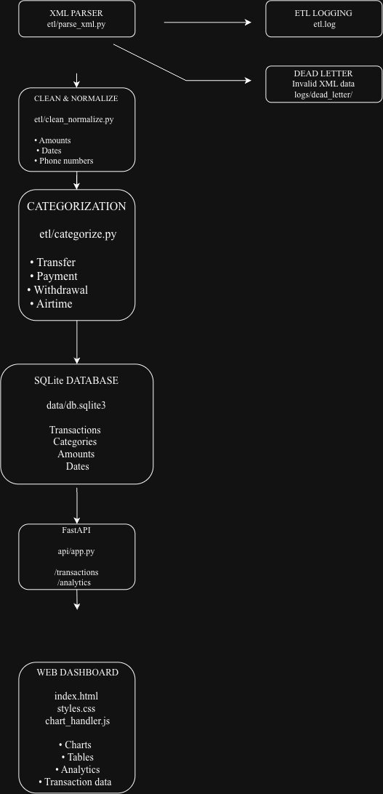

# MoMo Analytics System

## About the Team

We are **EMS Systems**, a team of Software Engineering students passionate about using technology to solve real-world problems. We work together to build practical, accessible, and user-centered solutions that respond to people’s needs and make everyday experiences better.

## Project Description

The **MoMo Analytics System** is a full-stack application designed to process and analyze Mobile Money (MoMo) SMS transaction data provided in XML format. The system will extract, clean, normalize, and categorize transaction data before storing it in a relational database. The processed data will then be used to provide a frontend dashboard for analyzing and visualizing transaction information.

## Objectives

- Process MoMo transaction data
- Organize transaction information in a structured database
- Categorize different types of transactions
- Maintain accurate and consistent records
- Support analysis of mobile money transaction data

## Team Members

* **Isingizwe Mukama Elohim Malaïka**
* **Erica Sheja Rurangwa**
* **Ishimwe Samuel**

## System Architecture

The planned system will follow this workflow:

**MoMo XML Data → XML Parser → Data Cleaning & Normalization → Transaction Categorization → Database → API → Frontend Dashboard -> scripts --> Testing**

The architecture will allow the system to process raw transaction data and transform it into useful information that can be explored through the dashboard.

## Database Design

The MoMo Analytics System uses a relational database to organize and manage mobile money transaction data.

The main entities are:

- Users
- Transactions
- Transaction Categories
- Transaction Participants
- System Logs

The database uses primary keys, foreign keys, constraints, and indexes to maintain data integrity and support efficient data management.

The Entity Relationship Diagram and detailed database design documentation are available in the `docs/` directory.

## Database Setup

The database setup script is located at:

`database/database_setup.sql`

It contains the database tables, relationships, constraints, indexes, sample data, and test queries.

## JSON Examples

JSON examples for the main database entities are available in:

`examples/json_schemas.json`

The examples demonstrate how database records can be represented in JSON format, including related transaction information.

## Testing

The database was tested using sample queries to verify:

- Data insertion
- Data retrieval
- Data updating
- Data deletion
- Table relationships
- Primary and foreign key constraints
- Data validation rules

Screenshots of the database queries and results are included in the Database Design Document.

## Documentation

The project documentation is available in the `docs/` directory.

It includes:

- Entity Relationship Diagram (ERD)
- Database Design Document
- Database design rationale
- Data dictionary
- Sample database queries
- Database constraints and validation rules


### Architecture Diagram

(https://drive.google.com/file/d/1d7LZ1N_xzwSCrUD2ICQTqSIA67nqOvrM/view?usp=sharing)

The architecture diagram is also available in the repository:



## Scrum Board

We use a Scrum board to organize our work, track progress, and collaborate throughout the development process.

[View our scrum board](https://github.com/orgs/entreprisewebdev/projects/1)

Our board contains the following stages:

* **To Do** – Tasks that have not yet been started
* **In Progress** – Tasks currently being worked on
* **Done** – Completed tasks

  
## Project Structure

- `api/` — API-related files
- `database/` — SQL database setup and implementation
- `docs/` — ERD and database design documentation
- `examples/` — JSON examples
- `etl/` — Data processing and transformation
- `scripts/` — Utility and execution scripts
- `tests/` — Testing files

```text
momo-analytics-system/
├── README.md
├── .gitignore
├── .env.example
├── requirements.txt
├── index.html
├── architecture/
│   └── system-architecture.png
├── web/
│   ├── styles.css
│   ├── chart_handler.js
│   └── assets/
├── data/
│   ├── raw/
│   ├── processed/
│   └── logs/
│       └── dead_letter/
├── docs/
│   ├── Database_Design_Document.pdf
│   ├── ERD.png
│   └── AI_Usage_Log.pdf
├── examples/
│   ├── json_schemas.json
├── database/
│   ├── database_setup.sql
├── etl/
│   ├── __init__.py
│   ├── config.py
│   ├── parse_xml.py
│   ├── clean_normalize.py
│   ├── categorize.py
│   ├── load_db.py
│   └── run.py
├── api/
│   ├── __init__.py
│   ├── app.py
│   ├── db.py
│   └── schemas.py
├── scripts/
│   ├── run_etl.sh
│   ├── export_json.sh
│   └── serve_frontend.sh
└── tests/
    ├── test_parse_xml.py
    ├── test_clean_normalize.py
    └── test_categorize.py
```


## Planned Features

* Parse MoMo SMS transaction data from XML.
* Clean and normalize transaction information.
* Categorize different types of transactions.
* Store structured transaction data in a relational database.
* Provide API endpoints for accessing transactions and analytics.
* Display transaction data through an interactive dashboard.
* Visualize transaction trends and summaries using charts and tables.
* Handle invalid or unparsed data through logging and a dead-letter system.

## Technologies

The project is planned to use:

* **Python** – ETL and backend processing
* **MySQL** – Relational database
* **FastAPI** – Backend API
* **HTML, CSS & JavaScript** – Frontend
* **Git & GitHub** – Version control and collaboration
* **Draw.io / Miro** – System architecture
* **Git & Github**
  
## Collaboration

### Isingizwe Malaika
- AI Usage Log
- SQL database script
- Database Design Document

### Erica Sheja Rurangwa
- Scrum Board
- Final checks and changes on the SQL database setup
- Entity Relationship Diagram (ERD)
- README updates

### Ishimwe Samuel
- MySQL database execution and screenshots
- JSON examples

## AI Usage

AI tools were used in accordance with the assignment guidelines. AI assistance was used for permitted activities such as syntax checking, grammar checking, and reviewing technical work. Details of AI usage are recorded in the AI Usage Log.


## Project Status

**Current Phase:** Week 2 – Database design and implementation

During this phase, our team successfully designed and implemented a database for the MoMo SMS data processing system using the XML data and business requirements from Week 1. We created an ERD identifying the main entities, attributes, primary and foreign keys, relationships, and a junction table, then implemented the design in MySQL with appropriate data types, constraints, indexes, and sample data. We tested the database and created JSON examples showing how the relational data can be represented for API responses. We documented the database design, data dictionary, queries, security and accuracy rules, and test results in a PDF, while also organizing the ERD, SQL script, JSON examples, and README in our GitHub repository. We updated our Scrum board and team participation records and maintained an AI usage log in accordance with the assignment requirements.
